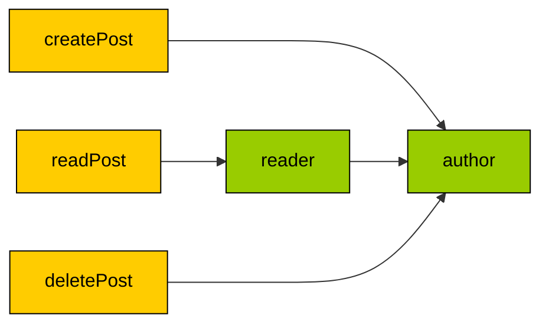

<p align="center">
    <a href="https://github.com/yiisoft" target="_blank">
        
    </a>
    <h1 align="center">Yii Role-Based Access Control</h1>
    <br>
</p>

[](https://packagist.org/packages/yiisoft/rbac)
[](https://packagist.org/packages/yiisoft/rbac)
[](https://github.com/yiisoft/rbac/actions?query=workflow%3Abuild)
[](https://codecov.io/gh/yiisoft/rbac)
[](https://dashboard.stryker-mutator.io/reports/github.com/yiisoft/rbac/master)
[](https://github.com/yiisoft/rbac/actions?query=workflow%3A%22static+analysis%22)
[](https://shepherd.dev/github/yiisoft/rbac)

This package provides [RBAC](https://en.wikipedia.org/wiki/Role-based_access_control) (Role-Based Access Control)
library. It is used in [Yii Framework](https://yiiframework.com) but is usable separately as well.

## Features

- Flexible RBAC hierarchy with roles, permissions, and rules.
- Role inheritance.
- Data could be passed to rules when checking access.
- Multiple storage adapters.
- Separate storages could be used for user-role assignments and role hierarchy.
- API to manage RBAC hierarchy.

## Requirements

- PHP 8.1 or higher.

## Installation

The package could be installed with [Composer](https://getcomposer.org):

```shell
composer require yiisoft/rbac
```

One of the following storages could be installed as well:

- [PHP storage](https://github.com/yiisoft/rbac-php) - PHP file storage;
- [DB storage](https://github.com/yiisoft/rbac-db) - database storage based on [Yii DB](https://github.com/yiisoft/db);
- [Cycle DB storage](https://github.com/yiisoft/rbac-cycle-db) - database storage based on
  [Cycle DBAL](https://github.com/cycle/database).

Also, there is a rule factory implementation - [Rules Container](https://github.com/yiisoft/rbac-rules-container) (based
on [Yii Factory](https://github.com/yiisoft/factory)).

All these can be replaced with custom implementations.

## General usage

### Setting up manager

First step when using RBAC is to configure an instance of `Manager`:

```php
use Yiisoft\Rbac\AssignmentsStorageInterface;
use Yiisoft\Rbac\ItemsStorageInterface;
use Yiisoft\Rbac\RuleFactoryInterface;

/**
* @var ItemsStorageInterface $itemsStorage
* @var AssignmentsStorageInterface $assignmentsStorage
* @var RuleFactoryInterface $ruleFactory
*/
$manager = new Manager($itemsStorage, $assignmentsStorage, $ruleFactory);
```

It requires the following dependencies:

- Items storage (hierarchy itself).
- Assignments storage where user IDs are mapped to roles.
- Rule factory. Creates a rule instance by a given name.

While storages are required, rule factory is optional and, when omitted, `SimpleRuleFactory` will be used. For more
advanced usage, such as resolving rules by aliases and passing arguments in rules constructor, install
[Rules Container](https://github.com/yiisoft/rbac-rules-container) additionally or write your own implementation.

A few tips for choosing storage backend:

- Roles and permissions could usually be considered "semi-static," as they only change when you update your application
  code, so it may make sense to use PHP storage for it.
- Assignments, on the other hand, could be considered "dynamic." They change more often: when creating a new user,
  or when updating a user role from within your application. So it may make sense to use database storage for assignments.

### Managing RBAC hierarchy

Before being able to check for permissions, an RBAC hierarchy must be defined. Usually it is done via either console
commands or migrations. Hierarchy consists of permissions, roles, and rules:

- Permissions are granules of access such as "create a post" or "read a post."
- A role is what is assigned to the user. The Role is granted one or more permissions. Typical roles are "manager" or
  "admin."
- Rule is a PHP class that has given some data answers a single question "given the data has the user the permission
  asked for."

To create a permission, use the following code:

```php
use Yiisoft\Rbac\ManagerInterface;
use Yiisoft\Rbac\Permission;

/** @var ManagerInterface $manager */
$manager->addPermission(new Permission('createPost'));
$manager->addPermission(new Permission('readPost'));
$manager->addPermission(new Permission('deletePost'));
```

To add some roles:

```php
use Yiisoft\Rbac\ManagerInterface;
use Yiisoft\Rbac\Role;

/** @var ManagerInterface $manager */
$manager->addRole(new Role('author'));
$manager->addRole(new Role('reader'));
```

Next, we need to attach permissions to roles:

```php
use Yiisoft\Rbac\ManagerInterface;

/** @var ManagerInterface $manager */
$manager->addChild('reader', 'readPost');
$manager->addChild('author', 'createPost');
$manager->addChild('author', 'deletePost');
$manager->addChild('author', 'reader');
```

Hierarchy for the example above:



Sometimes, basic permissions are not enough. In this case, rules are helpful. Rules are PHP classes that could be
added to permissions and roles:

```php
use Yiisoft\Rbac\Item;
use Yiisoft\Rbac\RuleContext;
use Yiisoft\Rbac\RuleInterface;

class ActionRule implements RuleInterface
{
    public function execute(?string $userId, Item $item, RuleContext $context): bool;
    {
        return $context->getParameterValue('action') === 'home';
    }
}
```

With rule added, the role or permission is considered only when rule's `execute()` method returns `true`.

The parameters are:

- `$userId` is user id to check permission against;
- `$item` is RBAC hierarchy item that rule is attached to;
- `$context` is a rule context providing access to parameters.

To use rules with `Manager`, specify their names with added permissions or roles:

```php
use Yiisoft\Rbac\ManagerInterface;
use Yiisoft\Rbac\Permission;

/** @var ManagerInterface $manager */
$manager->addPermission( 
    (new Permission('viewList'))->withRuleName(ActionRule::class),
);

// or

$manager->addRole(
    (new Role('NewYearMaintainer'))->withRuleName(NewYearOnlyRule::class)
);
```

The rule names `action_rule` and `new_year_only_rule` are resolved to `ActionRule` and `NewYearOnlyRule` class instances
accordingly via rule factory.

If you need to aggregate multiple rules at once, use composite rule:

```php
use Yiisoft\Rbac\CompositeRule;

// Fresh and owned
$compositeRule = new CompositeRule(CompositeRule::AND, [FreshRule::class, OwnedRule::class]);

// Fresh or owned
$compositeRule = new CompositeRule(CompositeRule::OR, [FreshRule::class, OwnedRule::class]);
```

### Assigning roles to users

To assign a certain role to a user with a given ID, use the following code:

```php
use Yiisoft\Rbac\ManagerInterface;

/** @var ManagerInterface $manager */
$userId = 100;
$manager->assign('author', $userId);
```

It could be done in an admin panel, via console command, or it could be built into the application business logic
itself.

### Check for permission

To check for permission, obtain an instance of `Yiisoft\Access\AccessCheckerInterface` and use it:

```php
use Psr\Http\Message\ResponseInterface; 
use Yiisoft\Access\AccessCheckerInterface;

public function actionCreate(AccessCheckerInterface $accessChecker): ResponseInterface
{
    $userId = getUserId();

    if ($accessChecker->userHasPermission($userId, 'createPost')) {
        // author has permission to create post
    }
}
```

Sometimes you need to add guest-only permission, which is not assigned to any user ID. In this case, you can specify a
role which is assigned to guest user:

```php
use Yiisoft\Access\AccessCheckerInterface;
use Yiisoft\Rbac\Permission;
use Yiisoft\Rbac\Role;

/** 
 * @var ManagerInterface $manager
 * @var AccessCheckerInterface $accessChecker 
 */
$manager->setGuestRoleName('guest');
$manager->addPermission(new Permission('signup'));
$manager->addRole(new Role('guest'));
$manager->addChild('guest', 'signup');

$guestId = null;
if ($accessChecker->userHasPermission($guestId, 'signup')) {
    // Guest has "signup" permission.
}
```

If there is a rule involved, you may pass extra parameters:

```php
use Yiisoft\Rbac\ManagerInterface;

/** @var ManagerInterface $manager */
$anotherUserId = 103;
if (!$manager->userHasPermission($anotherUserId, 'viewList', ['action' => 'home'])) {
    echo 'reader hasn\'t "index" permission';
}
```

## Documentation

- [Internals](docs/internals.md)

If you need help or have a question, the [Yii Forum](https://forum.yiiframework.com/c/yii-3-0/63) is a good place for that.
You may also check out other [Yii Community Resources](https://www.yiiframework.com/community).

## License

The Yii Dependency Injection is free software. It is released under the terms of the BSD License.
Please see [`LICENSE`](./LICENSE.md) for more information.

Maintained by [Yii Software](https://www.yiiframework.com/).

## Support the project

[](https://opencollective.com/yiisoft)

## Follow updates

[](https://www.yiiframework.com/)
[](https://twitter.com/yiiframework)
[](https://t.me/yii3en)
[](https://www.facebook.com/groups/yiitalk)
[](https://yiiframework.com/go/slack)
